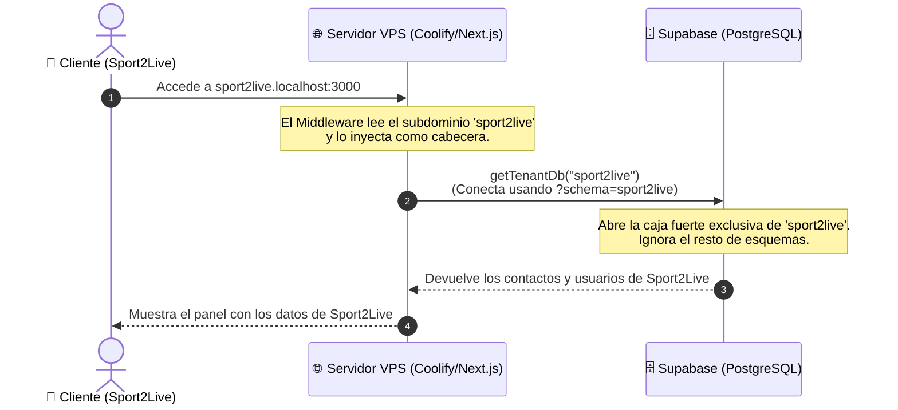

# Arquitectura de Tu SaaS: ¿Cómo encaja Supabase aquí?

Para entender cómo se conectan el **Servidor (Coolify/VPS)**, tu **Aplicación (Next.js)** y la **Base de Datos (Supabase)**, utilizaremos la metáfora de un **Edificio de Oficinas Inteligente**.

---

## 🏢 La Metáfora: El Edificio "Palm Business Center"

Imagina que tu SaaS es un gran edificio de oficinas donde hospedas a distintas empresas clientes (Gastroshows, Sport2Live, etc.).

```
                   +--------------------------------------------+
                   |       🏢 PALM BUSINESS CENTER (SaaS)       |
                   +--------------------------------------------+
                                         |
         +-------------------------------+-------------------------------+
         |                                                               |
 🚪 LOBBY Y ASCENSOR                                            🗄️ SÓTANO DE SEGURIDAD
 (Servidor VPS / Coolify)                                       (Base de Datos Supabase)
 - Recibe a los visitantes.                                     - Almacena todos los archivos.
 - Revisa a qué oficina van.                                    - Cada oficina tiene su propia caja
 - Los dirige al piso correcto.                                   fuerte blindada (Esquema/Schema).
```

### 1. El Lobby y los Ascensores (Tu VPS con Coolify / Next.js)
Cuando un usuario escribe `sport2live.com` en su navegador:
- Llega al **Lobby (Caddy/Coolify)**. El portero lee el dominio y dice: *"Ah, vienes a ver a Sport2Live"*.
- Te sube al **Ascensor (Next.js Middleware)**, el cual marca automáticamente el piso asignado a Sport2Live y te transporta a su oficina virtual.

### 2. Las Oficinas Privadas (Tus Tenants / Instancias)
Cada cliente tiene su propia oficina en el edificio.
- La oficina de **Gastroshows** tiene sus propios empleados y archivadores.
- La oficina de **Sport2Live** está en otra planta, tiene sus propios clientes y no puede ver lo que hay dentro de Gastroshows.

### 3. Las Cajas Fuertes en el Sótano (Supabase PostgreSQL)
En lugar de que cada oficina tenga una caja fuerte pequeña y cara en su piso, el edificio tiene un **sótano blindado centralizado (Supabase)**.
- En este sótano hay una sola habitación acorazada (Base de Datos PostgreSQL).
- Dentro de esa habitación, cada empresa tiene una **caja fuerte independiente (un Esquema de Base de Datos - Schema)**.
- **Sport2Live** tiene la llave de la caja `schema_sport2live`.
- **Gastroshows** tiene la llave de la caja `schema_gastroshows`.
- El sistema de seguridad de Supabase garantiza que nadie pueda abrir la caja de otra empresa.

---

## 📊 Esquema Técnico del Flujo de Datos

Así es como viaja la información desde el navegador del usuario hasta la base de datos:



---

## 🛠️ ¿Qué hace cada pieza en tu SaaS?

| Componente | ¿Qué es? | Su trabajo en el SaaS | Coste Estimado |
| :--- | :--- | :--- | :--- |
| **Coolify (en VPS)** | El Administrador del Edificio | Automatiza los despliegues de Next.js, enruta los subdominios (`*.tudominio.com`) y genera los certificados SSL gratis. | **~4.50€/mes** (Servidor en Hetzner) |
| **Next.js (App)** | La Oficina Virtual | Procesa la lógica de negocio, decide qué pantallas mostrar y le pide los datos correctos al sótano. | *Incluido en el VPS* |
| **Supabase** | El Sótano Acorazado (Base de Datos) | Almacena y protege la información. Al recibir la conexión con el parámetro `schema=nombre`, Postgres redirige la consulta al cajón correcto de forma aislada. | **0€** (Plan gratuito inicial / $25 Pro) |
| **Prisma** | El Mensajero | Traduce el código de Next.js (`db.contact.findMany()`) a lenguaje SQL y lo envía al esquema correcto. | *Gratis (Librería)* |
