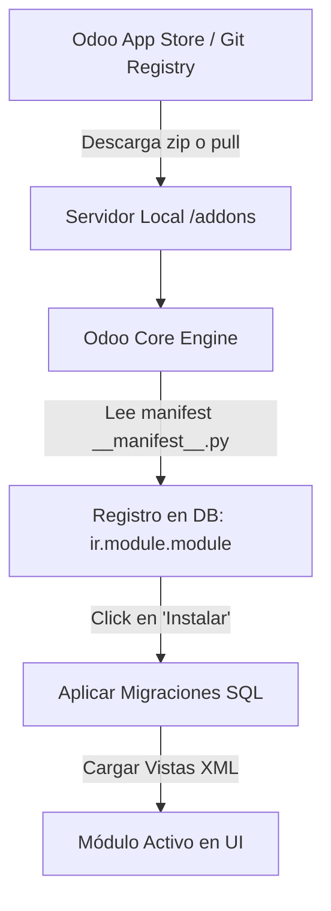

# Estrategia de Hosting, Arquitectura de Módulos y Monetización — Palm ERP

Este documento detalla el diseño de infraestructura para escalar **Palm ERP** a miles de clientes con costes de servidor mínimos (cercanos a $0), describe el funcionamiento interno del sistema de módulos (comparándolo con Odoo) y establece un modelo de negocio altamente rentable regalando el software Core.

---

## 1. ¿Cómo gestiona Odoo sus módulos y dónde viven?

En Odoo, los módulos (o *addons*) son directorios estructurados en Python y XML que contienen la lógica de negocio, los modelos de base de datos y la interfaz de usuario.



### Mecánica Interna de Odoo:
1. **Ubicación Física**: Los módulos viven en el sistema de archivos del servidor (en carpetas configuradas en el parámetro `addons_path`).
2. **El Manifiesto (`__manifest__.py`)**: Cada módulo tiene un archivo de metadatos que describe su nombre, versión, dependencias de otros módulos, y qué archivos XML/datos de carga inicial debe leer.
3. **Ciclo de Vida en Base de Datos**:
   - Odoo almacena el estado de los módulos (`uninstalled`, `installed`, `to upgrade`) en una tabla interna llamada `ir.module.module`.
   - Cuando haces click en **Instalar**, Odoo:
     - Comprueba y resuelve dependencias.
     - Ejecuta código de migración SQL para crear/modificar tablas en PostgreSQL.
     - Carga los archivos XML que describen las vistas de usuario y las guarda en la tabla `ir.ui.view`.
     - Reinicia o recarga el hilo del servidor en memoria para cargar el nuevo código Python.

---

## 2. Adaptación a Palm (Next.js + TypeScript): La estrategia "Zero-Overhead"

En Node.js/Next.js, la compilación e importación dinámica de código a tiempo de ejecución (especialmente en entornos Serverless como Vercel) es compleja e ineficiente debido a la naturaleza estática del empaquetado (Webpack/Turbopack). 

Para lograr el coste más barato y la máxima velocidad, Palm utilizará la **estrategia de compilación unificada con Feature Flags de Base de Datos** (Modelo Pre-bundling).

```text
    ┌──────────────────────────────────────────────────────────────┐
    │                    PALM ERP MONOREPO (Next.js)               │
    │  Contiene todo el Core + Todos los Módulos oficiales en:    │
    │  src/modules/crm, src/modules/bookings, src/modules/billing  │
    └──────────────────────────────┬───────────────────────────────┘
                                   ▼
                       Despliegue Único (Vercel/VPS)
                                   │
                ¿El Tenant X tiene activo 'bookings'?
                       /                       \
                     SÍ                         NO
                     /                           \
       ┌───────────────────────────┐       ┌───────────────────────────┐
       │   Renderiza Sidebar y UI  │       │   Oculta / Restringe UI   │
       │   y permite acceso a APIs │       │   Retorna 403 en API      │
       └───────────────────────────┘       └───────────────────────────┘
```

### Ventajas de esta estrategia:
* **Coste $0 de gestión**: No necesitas descargar ni desempaquetar archivos ZIP en caliente en el servidor del cliente.
* **Instalación Instantánea**: Al pulsar "Instalar", simplemente se cambia una fila en la tabla `Setting` (o `ModuleState`) a `active: true`. La interfaz se actualiza al instante sin reiniciar el servidor.
* **Máxima Seguridad**: No ejecutas código de terceros descargado de internet de forma arbitraria en tu servidor principal, previniendo inyecciones maliciosas.

---

## 3. Arquitectura de Servidores y Base de Datos Ultra Barata

Para regalar la aplicación y no morir en el intento por los costes de servidores, utilizaremos una arquitectura asimétrica extremadamente optimizada:

| Componente | Rol | Tecnología Recomendada | Coste Estimado |
| :--- | :--- | :--- | :--- |
| **Repositorio / App Store** | Aloja el catálogo de módulos, metadatos, documentación y versiones | Cloudflare Pages (Hosting) + Cloudflare R2 (Almacenamiento de assets/ZIPs) | **$0 USD / mes** (Ilimitado tráfico/egreso) |
| **ERP SaaS (Multi-Tenant)** | Aloja la aplicación que usan los clientes finales (si eligen la opción en la nube) | VPS en Hetzner / DigitalOcean (o Docker con Coolify) | **$5 - $10 USD / mes** (Soporta 100+ clientes) |
| **Bases de Datos** | Almacena los datos aislados de cada cliente | Un único VPS con PostgreSQL (Bases de datos aisladas por cliente) o Neon.tech | **$5 USD / mes** (o gratis con planes Serverless) |

### Estrategia de Base de Datos Multi-Inquilino (Multi-Tenancy)

Para alojar a cientos de empresas de forma barata y eficiente, tenemos dos opciones:

```mermaid
graph TD
    subgraph A [Opción 1: Database-per-Tenant (Recomendado Seguridad)]
        App[Next.js App] --> DB1[(Empresa A DB)]
        App --> DB2[(Empresa B DB)]
        App --> DB3[(Empresa C DB)]
    end
    subgraph B [Opción 2: Shared-Database (Máximo Ahorro)]
        App2[Next.js App] --> DB_Shared[(Single DB)]
        DB_Shared -->|Filtrado por RLS| T1[Fila: Tenant_ID = A]
        DB_Shared -->|Filtrado por RLS| T2[Fila: Tenant_ID = B]
    end
```

#### Comparativa Técnica:

1. **Una Base de Datos por Inquilino (Recomendado)**:
   * **Cómo funciona**: Un solo servidor PostgreSQL físico. Cada cliente nuevo ejecuta un comando `CREATE DATABASE db_cliente_x`. La aplicación Next.js selecciona dinámicamente la URL de conexión de Prisma según el subdominio (`clienteA.palm.com` -> `db_cliente_a`).
   * **Ventajas**: Aislamiento total de datos. Si un cliente quiere una copia de seguridad, simplemente exportas su base de datos. Si decide marcharse, borras su base de datos sin afectar a nadie.
   * **Costes**: Un servidor PostgreSQL de $5/mes en Hetzner con 2GB de RAM puede soportar fácilmente **200+ bases de datos inactivas/bajas** simultáneamente debido a que Postgres es sumamente eficiente con bases de datos vacías o con poco tráfico.

2. **Base de Datos Compartida con Seguridad de Fila (RLS - Row Level Security)**:
   * **Cómo funciona**: Una sola base de datos, una sola tabla `Contact`, `User`, etc. Todas las tablas tienen una columna `tenantId`. Todas las consultas SQL filtran por ese ID.
   * **Ventajas**: El coste de infraestructura es ridículamente bajo y las migraciones de Prisma se ejecutan una sola vez.
   * **Desventajas**: Mayor riesgo de bugs (si te olvidas de filtrar por `tenantId`, un cliente podría ver datos de otro). Complicado si un cliente pide un *backup* exclusivo de sus datos.

---

## 4. Eficiencia bajo tráfico masivo de descargas y uso

¿Se puede ofrecer un tráfico alto de manera eficiente y barata? **Sí, gracias a la computación en el Edge y CDNs.**

1. **Descargas de Módulos (Catálogo)**:
   * Las descargas no deben pasar por el servidor Next.js de producción.
   * Todos los assets de la tienda y archivos comprimidos deben servirse desde **Cloudflare R2**. Cloudflare **no cobra por ancho de banda de salida (egress fees)**, lo que significa que si un millón de personas descargan un módulo de 5MB, tu factura a fin de mes por tráfico de descarga será exactamente de **$0 USD**.

2. **Instalaciones y Desinstalaciones**:
   * En nuestro modelo de "Feature Flags", instalar un módulo simplemente ejecuta una query rápida: `UPDATE "Setting" SET value = 'true' WHERE key = 'module_crm_enabled' AND tenant_id = X`.
   * Esto toma **menos de 5 milisegundos** y consume virtualmente 0 recursos de CPU.
   * La desinstalación es igual de ligera.

---

## 5. El Modelo de Negocio: Regalando el Software Core

Regalar el programa (Open Source o Cloud Starter de $0) es una excelente estrategia de marketing que destruye la fricción de entrada de los clientes. Sin embargo, para hacerlo sostenible y rentable, la monetización se desplaza hacia servicios de alto valor:

```text
                  ┌─────────────────────────────────────────┐
                  │          EMBUDO DE CONVERSIÓN           │
                  └────────────────────┬────────────────────┘
                                       │
                                       ▼
        [ TRÁFICO Y ADOPCIÓN ] ─────────────────► CORE ERP GRATUITO ($0)
                                                    • Self-hosted gratis
                                                    • Comunidad activa
                                       │
                                       ▼
        [ MONETIZACIÓN AUTOMÁTICA ] ────────────► PALM CLOUD SAAS
                                                    • Backups automáticos ($9-$29/mes)
                                                    • Hosting sin complicaciones
                                                    • Tienda de módulos premium
                                       │
                                       ▼
        [ ALTO VALOR B2B ] ─────────────────────► SERVICIOS PROFESIONALES
                                                    • Consultoría de procesos ($100/h)
                                                    • Migración de datos (One-time fee)
                                                    • Desarrollo a medida
```

### Líneas de Ingreso Detalladas:

1. **La Nube Administrada (Palm Cloud)**:
   * *El problema del cliente*: La mayoría de las PYMEs no saben qué es Docker, PostgreSQL ni cómo configurar SSL.
   * *Tu oferta*: "El software es gratis si te lo instalas tú. Pero si quieres que funcione en 1 click, con backups automáticos cada hora, certificado SSL y soporte técnico, cuesta **$19/mes**".
   * *Margen de beneficio*: Alojar a ese cliente en tu VPS multi-tenant te cuesta **$0.10/mes**. Tu margen de beneficio neto es superior al **95%**.

2. **Consultoría de Implementación y Parametrización (El gran motor)**:
   * Un ERP no es como Slack o Trello; afecta a la contabilidad, facturación, stock y operaciones de la empresa.
   * Las PYMEs siempre necesitan un experto que entienda sus flujos de trabajo y configure el ERP para ellos.
   * **Tarifas**: Puedes cobrar paquetes de implantación desde **$1,500 USD** hasta **$10,000 USD** que incluyen:
     * Mapeo de procesos analógicos a Palm ERP.
     * Carga inicial y limpieza de datos (importar clientes de Excel viejos).
     * Configuración de formatos de factura y pasarelas de pago.

3. **Auditoría de Datos y Procesos**:
   * Auditorías anuales o trimestrales de seguridad, cumplimiento de RGPD (o leyes locales de facturación electrónica como la Ley Crea y Crece en España).
   * Cobrar un fee fijo por validar que el sistema no tiene descuadres de stock ni fugas de facturación.

4. **Marketplace de Módulos Premium**:
   * Si un desarrollador tercero quiere vender un módulo premium en tu catálogo (ej. Integración avanzada con Salesforce o pasarelas de pago locales en LATAM), cobras un **30% de comisión** sobre la venta (al estilo Apple App Store o Shopify App Store).
   * Creas tus propios módulos ultra-especializados de pago (ej. Módulo de conexión con máquinas de control industrial) con suscripción mensual.

5. **Palm Academy (Formación y Certificaciones)**:
   * **Para Clientes**: Cursos en video grabados sobre cómo gestionar la contabilidad o el inventario con Palm ERP. Aumenta la retención del cliente.
   * **Para Partners (Agencias)**: Certificaciones oficiales para que otras agencias de desarrollo puedan vender e implantar Palm ERP a nivel local, cobrando una membresía anual de Partner Autorizado.

---

## 6. Hoja de Ruta Recomendada para Palm ERP

1. **Fase 1: Monolito Modular Pre-bundlado** (Estado actual del repositorio):
   * Todos los módulos viven en `src/modules/` y se activan/desactivan mediante la base de datos.
   * Coste de desarrollo y despliegue: **Mínimo**.
   * Ideal para validar el MVP con los primeros clientes reales.

2. **Fase 2: Multi-Tenancy Isolada**:
   * Configurar el Middleware de Next.js para detectar el subdominio y enrutar las peticiones a bases de datos PostgreSQL independientes utilizando pools dinámicos de conexión.

3. **Fase 3: Marketplace Estático**:
   * Montar un JSON público en Cloudflare Pages que actúe como catálogo de módulos disponibles para que la UI de administración de Palm consuma este feed y muestre qué módulos oficiales "no instalados" se pueden desbloquear o adquirir.
